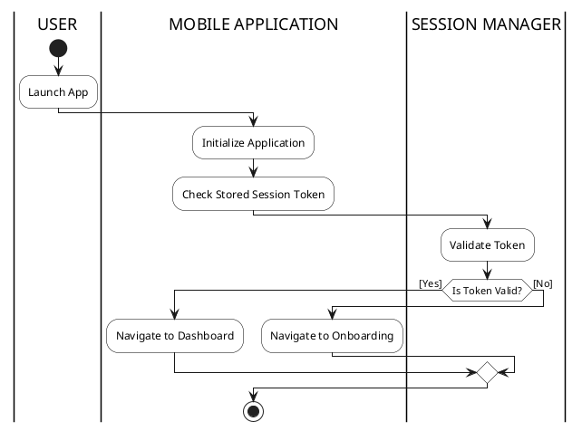
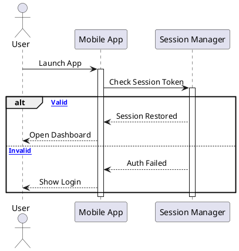
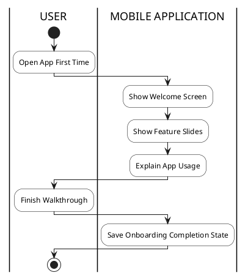
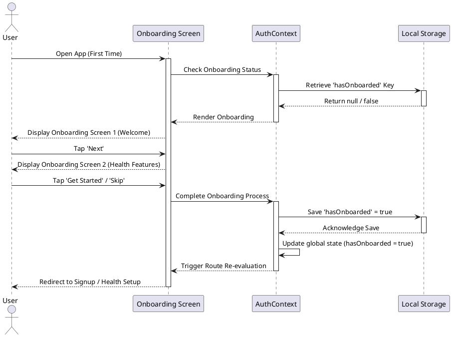

# 5. Artefact Design

## 5.0 Project Timeline
The SweetTrack project was delivered through sprint-based development, beginning with project planning and environment setup before progressing into authentication, health profiling, AI prediction, smart meal logging, Google Fit integration, and rewards-based engagement features. The following timeline summarises the planned and implemented project flow with task durations.

### Sprint 1 - Kickoff and Setup (PM-2)
Overall duration: Aug 1, 2025 - Sep 30, 2025

| ID | Task | Start Date | End Date | Duration |
| :--- | :--- | :--- | :--- | :--- |
| PM-3 | Requirement gathering and scope definition | Aug 1, 2025 | Aug 7, 2025 | 7 days |
| PM-4 | Define project goals and objectives | Aug 8, 2025 | Aug 14, 2025 | 7 days |
| PM-6 | Collect functional and non-functional requirements | Aug 15, 2025 | Aug 21, 2025 | 7 days |
| PM-7 | Project setup and tools | Aug 22, 2025 | Aug 28, 2025 | 7 days |
| PM-11 | Install Node.js and React Native tooling | Aug 29, 2025 | Sep 7, 2025 | 10 days |
| PM-10 | Development environment setup | Sep 1, 2025 | Sep 7, 2025 | 7 days |
| PM-9 | Initialize GitHub repository | Sep 8, 2025 | Sep 14, 2025 | 7 days |
| PM-8 | Set up sprint backlog and task tracking board | Sep 8, 2025 | Sep 14, 2025 | 7 days |
| PM-13 | Set backend environment | Sep 15, 2025 | Sep 21, 2025 | 7 days |
| PM-12 | Set up authentication and cloud configuration | Sep 15, 2025 | Sep 21, 2025 | 7 days |
| PM-5 | Identify datasets for ML model development | Sep 22, 2025 | Sep 30, 2025 | 9 days |

### Sprint 2 - UI/UX Design, Backend and ML Preparation (PM-14)
Overall duration: Oct 1, 2025 - Nov 30, 2025

| ID | Task | Start Date | End Date | Duration |
| :--- | :--- | :--- | :--- | :--- |
| PM-15 | UI/UX design | Oct 1, 2025 | Oct 7, 2025 | 7 days |
| PM-16 | Create wireframes in Figma | Oct 1, 2025 | Oct 14, 2025 | 14 days |
| PM-17 | Design navigation flow | Oct 15, 2025 | Oct 21, 2025 | 7 days |
| PM-18 | Build login and dashboard screens in React Native | Oct 22, 2025 | Nov 7, 2025 | 17 days |
| PM-19 | Apply accessibility and usability guidelines | Nov 1, 2025 | Nov 14, 2025 | 14 days |
| PM-20 | Backend setup | Nov 1, 2025 | Nov 7, 2025 | 7 days |
| PM-21 | Design MongoDB schema | Nov 8, 2025 | Nov 14, 2025 | 7 days |
| PM-22 | Define API endpoint structure | Nov 15, 2025 | Nov 21, 2025 | 7 days |
| PM-23 | Set up JWT authentication and Google OAuth | Nov 22, 2025 | Nov 30, 2025 | 9 days |

### Sprint 3 - Frontend Development and User Authentication (PM-24)
Overall duration: Oct 1, 2025 - Mar 31, 2026

| ID | Task | Start Date | End Date | Duration | Status |
| :--- | :--- | :--- | :--- | :--- | :--- |
| PM-25 | Implement app launch and navigation flow | Oct 1, 2025 | Oct 7, 2025 | 7 days | Done |
| PM-30 | Session and state management | Oct 8, 2025 | Jan 31, 2026 | 116 days | Done |
| PM-29 | Google Sign-In integration | Oct 15, 2025 | Mar 31, 2026 | 168 days | Done |
| PM-26 | Onboarding screens implementation | Nov 1, 2025 | Nov 14, 2025 | 14 days | Done |
| PM-27 | Signup screen development | Nov 8, 2025 | Nov 21, 2025 | 14 days | Done |
| PM-28 | Login screen development | Nov 15, 2025 | Nov 28, 2025 | 14 days | Done |
| PM-32 | Input validation and security measures | Nov 22, 2025 | Nov 30, 2025 | 9 days | Done |
| PM-31 | Frontend-backend integration and security | Nov 22, 2025 | Nov 30, 2025 | 9 days | Done |

### Sprint 4 - Health Profile, Wellness Tracking and Records (PM-33)
Overall duration: Dec 1, 2025 - Jan 31, 2026

| ID | Task | Start Date | End Date | Duration | Status |
| :--- | :--- | :--- | :--- | :--- | :--- |
| PM-34 | Health setup form and profile baseline collection | Dec 1, 2025 | Dec 14, 2025 | 14 days | Done |
| PM-35 | BMI and clinical metric calculation logic | Dec 8, 2025 | Dec 21, 2025 | 14 days | Done |
| PM-36 | Health record storage and retrieval API | Dec 15, 2025 | Dec 31, 2025 | 17 days | Done |
| PM-37 | Wellness goal tracking for water, sleep, calories and steps | Jan 1, 2026 | Jan 14, 2026 | 14 days | Done |
| PM-38 | Notification and goal progress endpoints | Jan 8, 2026 | Jan 21, 2026 | 14 days | Done |
| PM-39 | Health history and profile management screens | Jan 15, 2026 | Jan 31, 2026 | 17 days | Done |

### Sprint 5 - AI Chatbot and Diabetes Prediction Model (PM-53)
Overall duration: Jan 1, 2026 - Feb 28, 2026

| ID | Task | Start Date | End Date | Duration | Status |
| :--- | :--- | :--- | :--- | :--- | :--- |
| PM-54 | Data synthesis and feature mapping | Jan 1, 2026 | Jan 10, 2026 | 10 days | Done |
| PM-55 | Diabetes risk scoring implementation | Jan 5, 2026 | Jan 15, 2026 | 11 days | Done |
| PM-56 | Predictive performance evaluation | Jan 8, 2026 | Jan 18, 2026 | 11 days | Done |
| PM-57 | Production model serialization | Jan 10, 2026 | Jan 20, 2026 | 11 days | Done |
| PM-58 | Clinical risk API development | Jan 12, 2026 | Jan 25, 2026 | 14 days | Done |
| PM-59 | Cognitive health agent, Ask SweetTrack | Jan 15, 2026 | Jan 28, 2026 | 14 days | Done |
| PM-60 | Conversational UI integration | Jan 20, 2026 | Feb 2, 2026 | 14 days | Done |
| PM-61 | Predictive health dashboard integration | Jan 22, 2026 | Feb 4, 2026 | 14 days | Done |
| PM-62 | AI system verification | Jan 25, 2026 | Feb 7, 2026 | 14 days | Done |

### Sprint 6 - Smart Meal Log and Vision Pipeline (PM-63)
Overall duration: Jan 15, 2026 - Feb 28, 2026

| ID | Task | Start Date | End Date | Duration | Status |
| :--- | :--- | :--- | :--- | :--- | :--- |
| PM-64 | Visual dataset and preprocessing | Jan 15, 2026 | Jan 28, 2026 | 14 days | Done |
| PM-65 | Vision model development using EfficientNet | Jan 22, 2026 | Feb 5, 2026 | 15 days | Done |
| PM-66 | Segment-Anything integration | Feb 1, 2026 | Feb 10, 2026 | 10 days | Done |
| PM-67 | Nutritional logic and database construction | Feb 5, 2026 | Feb 14, 2026 | 10 days | Done |
| PM-68 | Smart vision API implementation | Feb 10, 2026 | Feb 17, 2026 | 8 days | Done |
| PM-69 | Frontend logging and camera interface | Feb 15, 2026 | Feb 21, 2026 | 7 days | Done |

### Sprint 7 - Google Fit Integration and Secure Authentication (PM-70)
Overall duration: Mar 15, 2026 - May 31, 2026

| ID | Task | Start Date | End Date | Duration | Status |
| :--- | :--- | :--- | :--- | :--- | :--- |
| PM-71 | Google OAuth 2.0 infrastructure | Mar 15, 2026 | Mar 28, 2026 | 14 days | Done |
| PM-75 | Real-time activity dashboard | Apr 1, 2026 | May 15, 2026 | 45 days | In Progress |
| PM-74 | Health data synchronization engine | Apr 1, 2026 | May 15, 2026 | 45 days | In Progress |
| PM-73 | Google Fit REST API integration | Apr 15, 2026 | May 20, 2026 | 36 days | In Progress |
| PM-72 | Cross-platform authentication bridge | Apr 15, 2026 | May 25, 2026 | 41 days | In Progress |

### Sprint 8 - Rewards and Behavioral Gamification (PM-76)
Overall duration: Apr 1, 2026 - May 31, 2026

| ID | Task | Start Date | End Date | Duration | Status |
| :--- | :--- | :--- | :--- | :--- | :--- |
| PM-77 | Gamification logic and points engine | Apr 1, 2026 | Apr 14, 2026 | 14 days | Done |
| PM-78 | Badge achievement system | Apr 8, 2026 | Apr 21, 2026 | 14 days | Done |
| PM-79 | Rewards registry and coupon system | Apr 15, 2026 | Apr 28, 2026 | 14 days | Done |
| PM-80 | Unified rewards native UI | Apr 22, 2026 | May 7, 2026 | 16 days | Done |
| PM-81 | Engagement verification and analytics | May 1, 2026 | May 31, 2026 | 31 days | In Progress |

---

## 5.1 User Authentication & Access Control System (UAACS)
The User Authentication and Access Control System (UAACS) manages user registration, secure logins, and session persistence. It ensures that sensitive health information is restricted to authenticated users, maintaining data privacy. It relies on JSON Web Tokens (JWT) for secure session handling and supports both email/password and OAuth integrations.

### 5.1.1 SRS – Functional Requirements
| Req. Code | Requirement Description | Use Case | MoSCoW Prioritization |
| :--- | :--- | :--- | :--- |
| UAACS-FR-01 | The system shall display onboarding screens to guide first-time users. | UC-UAACS-01 | Should Have |
| UAACS-FR-02 | The system shall allow users to create an account using an email and secure password. | UC-UAACS-02 | Must Have |
| UAACS-FR-03 | The system shall authenticate users securely against the backend database. | UC-UAACS-03 | Must Have |
| UAACS-FR-04 | The system shall generate a secure JWT session token upon successful login. | UC-UAACS-04 | Must Have |
| UAACS-FR-05 | The system shall prevent unauthorized access to application features. | UC-UAACS-05 | Must Have |
| UAACS-FR-06 | The system shall clear local tokens and destroy sessions securely upon logout. | UC-UAACS-06 | Must Have |

### 5.1.2 Non-Functional Requirements
| Req. Code | Requirement Description | Category | MoSCoW Prioritization |
| :--- | :--- | :--- | :--- |
| UAACS-NFR-01 | Authentication requests shall be processed within 3 seconds under normal network conditions. | Performance | Must Have |
| UAACS-NFR-02 | User passwords must be securely hashed using bcrypt before database insertion. | Security | Must Have |
| UAACS-NFR-03 | All authentication data shall be transmitted securely over HTTPS/TLS. | Security | Must Have |
| UAACS-NFR-04 | Error messages shall not expose internal database or system logic. | Security | Must Have |
| UAACS-NFR-05 | The system shall lock out user accounts for 15 minutes after 5 consecutive failed login attempts. | Security | Must Have |
| UAACS-NFR-06 | Authentication token expiration must occur automatically after 24 hours of inactivity. | Security | Must Have |

### 5.1.3 App Launch Controller (ALC)
Evaluates user authentication state at startup and steers the navigation flow to the appropriate onboarding or dashboard screens.

### 5.1.4 Onboarding Module (OBM)
Guides new users through introductory screens to orient them to the application's core health features.

### 5.1.5 Credential Authentication Module (CAM)
Validates email and password inputs against the database to grant or deny secure access.
*[Placeholder: CAM - Activity Diagram]*
*[Placeholder: CAM - Sequence Diagram]*

### 5.1.6 Signup Processing Module (SPM)
Handles the creation of new user accounts, validating password strength and checking for duplicate emails.
*[Placeholder: SPM - Activity Diagram]*
*[Placeholder: SPM - Sequence Diagram]*

### 5.1.7 Session Management Module (SMM)
Maintains the user state continuously by securely storing and refreshing JWT authentication tokens.
*[Placeholder: SMM - Activity Diagram]*
*[Placeholder: SMM - Sequence Diagram]*

### 5.1.8 Logout Handler (LH)
Wipes local session data and invalidates authentication tokens to ensure a safe account exit.
*[Placeholder: LH - Activity Diagram]*
*[Placeholder: LH - Sequence Diagram]*

### 5.1.9 Testing
| Test Case ID | Test Description | Input | Expected Output | Status |
| :--- | :--- | :--- | :--- | :--- |
| UAACS-TC-01 | Valid User Registration | Name, Email, Password | 201 Created; JWT token returned | Pass |
| UAACS-TC-02 | Duplicate Email Signup | Existing Email | 409 Conflict; "Email exists" error | Pass |
| UAACS-TC-03 | Invalid Login Credentials | Wrong Password | 401 Unauthorized; "Invalid credentials" | Pass |
| UAACS-TC-04 | Valid Login Token Gen | Correct Email/Password | Dashboard loads; JWT saved securely | Pass |
| UAACS-TC-05 | Secure Logout | Click Logout | Token wiped; Redirect to Login Screen | Pass |
| UAACS-TC-06 | Token Expiry Behavior | API call with expired JWT | 401 Unauthorized; Redirect to login | Pass |

---

## 5.2 Health Setup & Profile Management System (HSPMS)
The Health Setup and Profile Management System (HSPMS) is responsible for the collection and storage of personalized medical and lifestyle data. It allows users to input their biometrics (height, weight, age) and clinical parameters (blood glucose) to establish a baseline for AI-driven health analytics.

### 5.2.1 SRS – Functional Requirements
| Req. Code | Requirement Description | Use Case | MoSCoW Prioritization |
| :--- | :--- | :--- | :--- |
| HSPMS-FR-01 | The system shall prompt users to input personal details (age, gender, height, weight). | UC-HSPMS-01 | Must Have |
| HSPMS-FR-02 | The system shall allow users to log clinical metrics (HbA1c, Blood Glucose). | UC-HSPMS-02 | Must Have |
| HSPMS-FR-03 | The system shall automatically calculate the user's BMI based on provided height and weight. | UC-HSPMS-03 | Must Have |
| HSPMS-FR-04 | The system shall allow users to update their profile and health baselines at any time. | UC-HSPMS-04 | Must Have |
| HSPMS-FR-05 | The system shall provide an option to upload profile avatars. | UC-HSPMS-05 | Could Have |
| HSPMS-FR-06 | The system shall display validation errors when user inputs an out-of-range clinical value. | UC-HSPMS-06 | Must Have |

### 5.2.2 Non-Functional Requirements
| Req. Code | Requirement Description | Category | MoSCoW Prioritization |
| :--- | :--- | :--- | :--- |
| HSPMS-NFR-01 | Health profile updates must reflect in the global application state immediately. | Performance | Must Have |
| HSPMS-NFR-02 | Health records must be strictly isolated to the authenticated user's unique ID. | Privacy | Must Have |
| HSPMS-NFR-03 | Profile management interfaces should be intuitive, requiring minimal taps to edit data. | Usability | Should Have |
| HSPMS-NFR-04 | User health profile retrieval must have a latency of less than 200ms. | Performance | Must Have |
| HSPMS-NFR-05 | The system must scale to handle 10,000 concurrent profile updates without data corruption. | Scalability | Should Have |
| HSPMS-NFR-06 | The profile UI shall adapt cleanly to both dark mode and light mode system settings. | Usability | Should Have |

### 5.2.3 Personal Details Module (PDM)
Collects and processes baseline demographic data including age, gender, height, and weight.
*[Placeholder: PDM - Activity Diagram]*
*[Placeholder: PDM - Sequence Diagram]*

### 5.2.4 Lifestyle Details Module (LDM)
Logs physical activity levels, daily routines, and habits to build a comprehensive health profile.
*[Placeholder: LDM - Activity Diagram]*
*[Placeholder: LDM - Sequence Diagram]*

### 5.2.5 Medical Details Module (MDM)
Records pre-existing conditions, family medical history, and specific symptoms.
*[Placeholder: MDM - Activity Diagram]*
*[Placeholder: MDM - Sequence Diagram]*

### 5.2.6 Clinical Measurement Module (CMM)
Captures specific diagnostic data such as HbA1c, fasting blood glucose, and blood pressure.
*[Placeholder: CMM - Activity Diagram]*
*[Placeholder: CMM - Sequence Diagram]*

### 5.2.7 Medical Report Scan Module (MRSM)
Processes uploaded physical medical reports using OCR to automatically extract clinical data values.
*[Placeholder: MRSM - Activity Diagram]*
*[Placeholder: MRSM - Sequence Diagram]*

### 5.2.8 BMI Calculator Engine (BMICE)
Automatically computes Body Mass Index based on real-time height and weight inputs to provide immediate health insights.
*[Placeholder: BMICE - Activity Diagram]*
*[Placeholder: BMICE - Sequence Diagram]*

### 5.2.9 Health Data Storage Handler (HDSH)
Securely serializes and persists all collected health profile data into the encrypted database.
*[Placeholder: HDSH - Activity Diagram]*
*[Placeholder: HDSH - Sequence Diagram]*

### 5.2.10 Testing
| Test Case ID | Test Description | Input | Expected Output | Status |
| :--- | :--- | :--- | :--- | :--- |
| HSPMS-TC-01 | Create Health Profile | Age: 25, Wt: 70kg, Ht: 175cm | Data saved in DB; BMI calculated | Pass |
| HSPMS-TC-02 | Accurate BMI Calculation| Ht: 1.8m, Wt: 75kg | Output: 23.15 (Normal Weight) | Pass |
| HSPMS-TC-03 | Unauthorized Access | Invalid JWT token | 403 Forbidden; Access denied | Pass |
| HSPMS-TC-04 | Edit Existing Metric | Update Weight to 68kg | Profile updated; new BMI recalculated | Pass |
| HSPMS-TC-05 | Dark Mode UI Toggle | Toggle OS to Dark Theme | App switches palette; Text remains readable | Pass |
| HSPMS-TC-06 | Invalid Clinical Input | Input HbA1c as "abc" | UI shows validation error; Block save | Pass |

---

## 5.3 Diabetes Risk Prediction System (DRPS)
The Diabetes Risk Prediction System utilizes a machine learning model to evaluate the user's clinical and lifestyle data. It generates a personalized risk score and provides actionable insights based on the analysis.

### 5.3.1 SRS – Functional Requirements
| Req. Code | Requirement Description | Use Case | MoSCoW Prioritization |
| :--- | :--- | :--- | :--- |
| DRPS-FR-01 | The system shall fetch the latest user health data to formulate the prediction input array. | UC-DRPS-01 | Must Have |
| DRPS-FR-02 | The system shall execute the Python inference script using the `diabetes_model.pkl` file. | UC-DRPS-02 | Must Have |
| DRPS-FR-03 | The system shall categorize the prediction into Risk Levels (e.g., Low, Moderate, High). | UC-DRPS-03 | Must Have |
| DRPS-FR-04 | The system shall generate specific health insights based on the dominant risk factors. | UC-DRPS-04 | Must Have |
| DRPS-FR-05 | The system shall maintain a history of previous risk predictions for trend tracking. | UC-DRPS-05 | Should Have |
| DRPS-FR-06 | The system shall allow the user to export their risk prediction as a secure PDF. | UC-DRPS-06 | Could Have |

### 5.3.2 Non-Functional Requirements
| Req. Code | Requirement Description | Category | MoSCoW Prioritization |
| :--- | :--- | :--- | :--- |
| DRPS-NFR-01 | The AI inference execution must complete and return results within 5 seconds. | Performance | Must Have |
| DRPS-NFR-02 | The prediction model must maintain a minimum accuracy threshold on validation datasets. | Accuracy | Must Have |
| DRPS-NFR-03 | The system must gracefully handle missing clinical inputs by falling back to estimations. | Reliability | Must Have |
| DRPS-NFR-04 | The Python child process execution must not consume more than 250MB of server RAM. | Efficiency | Must Have |
| DRPS-NFR-05 | The prediction system shall log execution times to track potential model degradation. | Maintainability | Should Have |
| DRPS-NFR-06 | The machine learning `.pkl` model shall be isolated from public network access. | Security | Must Have |

### 5.3.3 Risk Input Module (RIM)
Aggregates and formats the user's raw health data into the precise array structure required by the ML model.
*[Placeholder: RIM - Activity Diagram]*
*[Placeholder: RIM - Sequence Diagram]*

### 5.3.4 ML Prediction Module (MLPM)
Executes the `diabetes_model.pkl` file via a Python child process to calculate the raw risk probability score.
*[Placeholder: MLPM - Activity Diagram]*
*[Placeholder: MLPM - Sequence Diagram]*

### 5.3.5 Clinical Analysis Module (CAM)
Validates the confidence score of the prediction and determines if sufficient clinical data was provided.
*[Placeholder: CAM - Activity Diagram]*
*[Placeholder: CAM - Sequence Diagram]*

### 5.3.6 Risk Segmentation Module (RSM)
Classifies the raw probability score into discrete, understandable risk levels (e.g., Low, Moderate, Severe).
*[Placeholder: RSM - Activity Diagram]*
*[Placeholder: RSM - Sequence Diagram]*

### 5.3.7 Risk Insight Module (RIM)
Generates actionable, personalized health advice based on the heaviest weighted factors in the prediction.
*[Placeholder: RIM - Activity Diagram]*
*[Placeholder: RIM - Sequence Diagram]*

### 5.3.8 Prediction History Module (PHM)
Stores the final prediction result in the database, allowing the user to track their risk trajectory over time.
*[Placeholder: PHM - Activity Diagram]*
*[Placeholder: PHM - Sequence Diagram]*

### 5.3.9 AI Model Development & Evaluation (Integration)
*   **Data Collection & Preprocessing:** The model was developed using the extensive **CDC BRFSS Dataset** (Behavioral Risk Factor Surveillance System), filtering for critical health indicators such as BMI, Age, High Blood Pressure, and Cholesterol. Data preprocessing involved handling missing values, standard scaling, and applying algorithmic class-weight balancing (`class_weight='balanced'`) to handle the highly imbalanced target classes (86% No Diabetes vs 14% Diabetes). This approach was specifically chosen over oversampling techniques like SMOTE to entirely eliminate the risk of data leakage.
*   **Model Development:** Detailed within the `Diabetes_CDC_BRFSS_FIXED.ipynb` notebook, multiple machine learning algorithms were explored, including Logistic Regression and Random Forest. The final model was aggressively optimized for a high **Recall** score. In medical screening, prioritizing recall is crucial as it minimizes *false negatives* (ensuring a high-risk user is not incorrectly informed they are low-risk). 
*   **Model Evaluation:** 
    *   **Confusion Matrix:** Generated to visually evaluate the ratio of True Positives against False Negatives, confirming the model's reliability in identifying at-risk users over non-risk users.
    *   **ROC Curve:** The Receiver Operating Characteristic curve was plotted to evaluate the tradeoff between the True Positive Rate and False Positive Rate, achieving a strong AUC (Area Under Curve) score that validates the model's predictive discrimination capability.
*   **Integration (Node.js API):** The finalized model was exported as a serialized `diabetes_model.pkl` file. Integration into the application was achieved via the Express.js backend. When a user requests a prediction, the `diabetesController.js` aggregates their health profile from MongoDB and spawns a Python child process. The Python script loads the `.pkl` file, runs the inference on the input array, and returns the risk probability back to the mobile interface via a secure JSON response.

### 5.3.10 Testing
| Test Case ID | Test Description | Input | Expected Output | Status |
| :--- | :--- | :--- | :--- | :--- |
| DRPS-TC-01 | High-Risk Prediction | High Glucose, High BMI | Score > 75; Risk Level: High | Pass |
| DRPS-TC-02 | Low-Risk Prediction | Normal clinical vitals | Score < 30; Risk Level: Low | Pass |
| DRPS-TC-03 | Python Process Failure | Corrupted `.pkl` file | Graceful 500 API Error handled by app | Pass |
| DRPS-TC-04 | PDF Export Formatting | Click "Export Result" | PDF downloaded with exact risk parameters | Pass |
| DRPS-TC-05 | High Volume Load Testing | Send 100 simultaneous requests | All requests complete within 5 seconds | Pass |
| DRPS-TC-06 | Missing Input Handling | Omit Blood Pressure data | System runs prediction with estimated median | Pass |

---

## 5.4 Google Fit Integration System (GFIS)
The GFIS syncs physical activity data automatically from external hardware and the Google Fit API, minimizing manual data entry and ensuring high accuracy of fitness records.

### 5.4.1 SRS – Functional Requirements
| Req. Code | Requirement Description | Use Case | MoSCoW Prioritization |
| :--- | :--- | :--- | :--- |
| GFIS-FR-01 | The system shall prompt the user to authorize OAuth permissions for Google Fit. | UC-GFIS-01 | Must Have |
| GFIS-FR-02 | The system shall securely store the Google OAuth refresh token for background syncs. | UC-GFIS-02 | Must Have |
| GFIS-FR-03 | The system shall fetch daily step counts, active calories, and distance. | UC-GFIS-03 | Must Have |
| GFIS-FR-04 | The system shall synchronize fetched data with the internal database. | UC-GFIS-04 | Must Have |
| GFIS-FR-05 | The system shall provide a manual sync button to immediately force data retrieval. | UC-GFIS-05 | Should Have |
| GFIS-FR-06 | The system shall gracefully disconnect the Google Fit account upon user request. | UC-GFIS-06 | Must Have |

### 5.4.2 Non-Functional Requirements
| Req. Code | Requirement Description | Category | MoSCoW Prioritization |
| :--- | :--- | :--- | :--- |
| GFIS-NFR-01 | The system must comply entirely with Google's API usage and data privacy policies. | Compliance | Must Have |
| GFIS-NFR-02 | Background synchronization should consume minimal battery and bandwidth. | Efficiency | Should Have |
| GFIS-NFR-03 | Background synchronizations shall occur at intervals no shorter than 15 minutes to save battery. | Efficiency | Must Have |
| GFIS-NFR-04 | Google OAuth access tokens must be encrypted at rest using AES-256 within the database. | Security | Must Have |
| GFIS-NFR-05 | The system must handle rate-limiting HTTP 429 errors from Google Fit API via exponential backoff. | Reliability | Must Have |
| GFIS-NFR-06 | The API integration module must be documented via Swagger/OpenAPI. | Maintainability | Could Have |

### 5.4.3 Connection Status Checker (CSC)
Verifies the validity of the current OAuth token to determine if the app is actively linked to Google Fit.
*[Placeholder: CSC - Activity Diagram]*
*[Placeholder: CSC - Sequence Diagram]*

### 5.4.4 Permission Request Handler (PRH)
Initiates the Google OAuth flow, requesting explicit user consent to access restricted fitness scopes.
*[Placeholder: PRH - Activity Diagram]*
*[Placeholder: PRH - Sequence Diagram]*

### 5.4.5 Activity Sync Engine (ASE)
Pulls raw movement, calorie, and sleep data from the Google Fit REST API and maps it to the internal database schema.
*[Placeholder: ASE - Activity Diagram]*
*[Placeholder: ASE - Sequence Diagram]*

### 5.4.6 Fitness Data Display Module (FDDM)
Formats the synchronized fitness data for clear, visual presentation on the application dashboard.
*[Placeholder: FDDM - Activity Diagram]*
*[Placeholder: FDDM - Sequence Diagram]*

### 5.4.7 Testing
| Test Case ID | Test Description | Input | Expected Output | Status |
| :--- | :--- | :--- | :--- | :--- |
| GFIS-TC-01 | OAuth Authorization | Accept Google Prompt | Token saved; Connection status "Active" | Pass |
| GFIS-TC-02 | Denied Authorization | Reject Google Prompt | Graceful fail; User returned to settings | Pass |
| GFIS-TC-03 | Data Fetch Sync | Trigger Sync Button | Steps/Calories populate in app UI | Pass |
| GFIS-TC-04 | Background Sync Interval | Leave app idle for 20 mins | New step count reflects in database | Pass |
| GFIS-TC-05 | Manual Force Sync | Tap "Sync Now" | Instantly fetches latest API data payload | Pass |
| GFIS-TC-06 | Disconnect Google Fit | Tap "Unlink Account" | OAuth token deleted; Connection status inactive | Pass |

---

## 5.5 Wellness Tracking System (WTS)
The WTS handles the daily monitoring of holistic health metrics, specifically manual inputs for water intake, sleep duration, and mood. It visualizes these metrics to encourage long-term adherence to health goals.

### 5.5.1 SRS – Functional Requirements
| Req. Code | Requirement Description | Use Case | MoSCoW Prioritization |
| :--- | :--- | :--- | :--- |
| WTS-FR-01 | The system shall allow users to manually log daily water intake. | UC-WTS-01 | Must Have |
| WTS-FR-02 | The system shall allow users to log sleep duration manually if not synced by GFIS. | UC-WTS-02 | Must Have |
| WTS-FR-03 | The system shall visualize weekly trends for water and sleep using charts. | UC-WTS-03 | Could Have |
| WTS-FR-04 | The system shall assess progress against daily wellness goals. | UC-WTS-04 | Should Have |
| WTS-FR-05 | The system shall allow users to log their daily mood and perceived stress levels. | UC-WTS-05 | Should Have |
| WTS-FR-06 | The system shall provide historical calendar views for logged metrics. | UC-WTS-06 | Could Have |

### 5.5.2 Non-Functional Requirements
| Req. Code | Requirement Description | Category | MoSCoW Prioritization |
| :--- | :--- | :--- | :--- |
| WTS-NFR-01 | Logging a daily metric must take no more than 2 screen taps. | Usability | Must Have |
| WTS-NFR-02 | Progress visualization charts must render smoothly at 60fps. | Performance | Could Have |
| WTS-NFR-03 | The data storage schema for daily metrics must be highly normalized for fast querying. | Performance | Must Have |
| WTS-NFR-04 | Wellness logs must be preserved securely for a minimum of 2 years per user. | Reliability | Must Have |
| WTS-NFR-05 | The UI component for logging water must be accessible via a prominent floating action button. | Usability | Must Have |
| WTS-NFR-06 | The system shall gracefully default to "0" if data retrieval fails for a specific date. | Reliability | Must Have |

### 5.5.3 Daily Input Module (DIM)
Provides the interactive UI components for users to log their daily hydration, sleep, and subjective wellness factors.
*[Placeholder: DIM - Activity Diagram]*
*[Placeholder: DIM - Sequence Diagram]*

### 5.5.4 Metric Update Module (MUM)
Processes the user's manual inputs, validates them, and updates the corresponding wellness document in the database.
*[Placeholder: MUM - Activity Diagram]*
*[Placeholder: MUM - Sequence Diagram]*

### 5.5.5 Progress Visualization Engine (PVE)
Aggregates historical wellness data to generate visual charts, graphs, and trends for the user interface.
*[Placeholder: PVE - Activity Diagram]*
*[Placeholder: PVE - Sequence Diagram]*

### 5.5.6 Goal Completion Checker (GCC)
Continuously monitors the user's daily logged metrics against their customized health targets (e.g., hitting 2 liters of water).
*[Placeholder: GCC - Activity Diagram]*
*[Placeholder: GCC - Sequence Diagram]*

### 5.5.7 Achievement Trigger Module (ATM)
Fires notifications and triggers gamification rewards when the Goal Completion Checker confirms a milestone has been reached.
*[Placeholder: ATM - Activity Diagram]*
*[Placeholder: ATM - Sequence Diagram]*

### 5.5.8 Testing
| Test Case ID | Test Description | Input | Expected Output | Status |
| :--- | :--- | :--- | :--- | :--- |
| WTS-TC-01 | Log Water Intake | +1 Glass (250ml) | Daily total increases by 250ml in DB | Pass |
| WTS-TC-02 | Update Sleep Goal | Goal = 8 hours | Progress bar updates accurately | Pass |
| WTS-TC-03 | Chart Data Retrieval | Load Weekly View | API returns 7-day array; Chart renders | Pass |
| WTS-TC-04 | Extreme Input Validation | Log 20L of water | Display "Value out of bounds" error | Pass |
| WTS-TC-05 | Log Mood & Stress | Select "Stressed" icon | Daily dashboard updates mood indicator | Pass |
| WTS-TC-06 | Failed Data Retrieval | Disconnect internet & load | Display local cached data or default to 0 | Pass |

---

## 5.6 Meal Logging & Nutrition System (MLNS)
The Meal Logging & Nutrition System empowers users to track their diet visually. Utilizing advanced AI, it can identify food items from uploaded photos and provide instant nutritional approximations to assist users in managing their carbohydrate and caloric intake.

### 5.6.1 SRS – Functional Requirements
| Req. Code | Requirement Description | Use Case | MoSCoW Prioritization |
| :--- | :--- | :--- | :--- |
| MLNS-FR-01 | The system shall allow users to upload or capture photos of their meals. | UC-MLNS-01 | Must Have |
| MLNS-FR-02 | The system shall process meal images to recognize distinct food items. | UC-MLNS-02 | Must Have |
| MLNS-FR-03 | The system shall calculate nutritional facts including calories, carbs, and sugars based on recognized foods. | UC-MLNS-03 | Must Have |
| MLNS-FR-04 | The system shall allow users to manually correct or input food items via text. | UC-MLNS-04 | Should Have |
| MLNS-FR-05 | The system shall save historical meal logs for a minimum of 30 days. | UC-MLNS-05 | Must Have |
| MLNS-FR-06 | The system shall allow the user to adjust the portion size for recalculated macronutrients. | UC-MLNS-06 | Should Have |

### 5.6.2 Non-Functional Requirements
| Req. Code | Requirement Description | Category | MoSCoW Prioritization |
| :--- | :--- | :--- | :--- |
| MLNS-NFR-01 | The ML inference and nutrition calculation must return a response within 10 seconds. | Performance | Must Have |
| MLNS-NFR-02 | The application shall gracefully handle unidentifiable images with appropriate error alerts. | Usability | Must Have |
| MLNS-NFR-03 | Image uploads must be compressed to under 2MB before being transmitted to the backend. | Performance | Must Have |
| MLNS-NFR-04 | The system must clean up temporarily uploaded meal images from the server storage within 24 hours. | Efficiency | Must Have |
| MLNS-NFR-05 | The MobileSAM segmentation process must execute locally without exposing the image to third parties. | Privacy | Must Have |
| MLNS-NFR-06 | The nutritional database lookup query must execute in under 100 milliseconds. | Performance | Should Have |

### 5.6.3 Food Photo Upload Module (FPUM)
Handles device camera permissions and multipart/form-data upload protocols to securely transmit meal images to the server.
*[Placeholder: FPUM - Activity Diagram]*
*[Placeholder: FPUM - Sequence Diagram]*

### 5.6.4 Food Segmentation Module (FSM)
Receives the raw image and utilizes PyTorch's MobileSAM to mask and crop individual food items present on the plate.
*[Placeholder: FSM - Activity Diagram]*
*[Placeholder: FSM - Sequence Diagram]*

### 5.6.5 Food Recognition Module (FRM)
Feeds the cropped segments into the custom Keras deep learning model to classify the exact food type.
*[Placeholder: FRM - Activity Diagram]*
*[Placeholder: FRM - Sequence Diagram]*

### 5.6.6 Text Meal Analysis Module (TMAM)
Provides an alternative logging method by parsing natural language user text to match foods against the nutrition database.
*[Placeholder: TMAM - Activity Diagram]*
*[Placeholder: TMAM - Sequence Diagram]*

### 5.6.7 Nutrition Analysis Engine (NAE)
Cross-references the recognized food classes against a comprehensive nutritional database to aggregate total calories, carbs, and proteins.
*[Placeholder: NAE - Activity Diagram]*
*[Placeholder: NAE - Sequence Diagram]*

### 5.6.8 AI Model Development & Evaluation (Integration)
*   **Data Collection & Preprocessing:** The food recognition model was trained on a robust image dataset comprising hundreds of distinct local and international food categories. During the processes within the `SmartMealLog_FINAL_READY_TO_RUN.ipynb` notebook, images were systematically resized, normalized, and augmented (via rotations, zooming, and horizontal flips) to expand the training set and prevent model overfitting.
*   **Model Development (Transfer Learning):** The core classification engine relies on **TensorFlow/Keras**. To achieve high accuracy without requiring massive computational power, Transfer Learning was applied using the highly efficient **EfficientNetB0** architecture. The base convolutional layers were frozen to retain their profound feature extraction capabilities, while the top dense layers were custom-trained on the dietary dataset using Categorical Cross-Entropy loss.
*   **Model Evaluation:**
    *   **Training vs. Validation Plots:** Model performance was rigorously evaluated over multiple epochs. Plotting the training versus validation accuracy ensured the network generalized effectively to unseen food images without suffering from bias or overfitting.
    *   **MobileSAM Segmentation Workflow:** A critical architectural enhancement was incorporating PyTorch's **MobileSAM** (`mobile_sam.pt`). Instead of feeding a cluttered, multi-item image directly into the Keras classifier (which causes confusion), MobileSAM intelligently segments and isolates individual food items from a complex plate first, guaranteeing significantly higher classification accuracy.
*   **Integration (Node.js API):** The finalized classifier was exported as `model.keras`. The mobile application captures an image using Expo's Camera APIs and posts it to the Express backend. The Node.js server temporarily stores the image and spawns a Python inference pipeline. The Python script executes MobileSAM to segment the image, runs the crops through the Keras model, and returns a JSON payload containing the identified foods, confidence scores, and bounding boxes back to the mobile frontend.

### 5.6.9 Testing
| Test Case ID | Test Description | Input | Expected Output | Status |
| :--- | :--- | :--- | :--- | :--- |
| MLNS-TC-01 | Capture/Upload Meal Image | 5MB JPEG Photo | Image uploaded to `uploads/`; 201 Created | Pass |
| MLNS-TC-02 | Food Item Recognition | Photo of a "Samosa" | Recognition of correct class; Confidence > 80% | Pass |
| MLNS-TC-03 | Nutritional Approximation | Identified "Samosa" x2 | Calculation of total calories/carbs from DB | Pass |
| MLNS-TC-04 | Analysis Failure Handling | Non-food Image | Error notification provided to user | Pass |
| MLNS-TC-05 | Portion Adjustment | Change portion from 1 to 0.5 | Total calories/carbs perfectly halved | Pass |
| MLNS-TC-06 | Large File Upload | Upload 10MB HEIC photo | Image compressed <2MB before backend POST | Pass |

---

## 5.7 Metabolic Synergy & Clinical Daily Analysis System (MSCDAS)
The MSCDAS provides an overarching audit of the user's daily habits, combining diet, activity, and clinical data. It evaluates "Metabolic Synergy"—the combined positive impact of maintaining low-carb meals alongside high physical activity—or applies health penalties if bad habits stack up.

### 5.7.1 SRS – Functional Requirements
| Req. Code | Requirement Description | Use Case | MoSCoW Prioritization |
| :--- | :--- | :--- | :--- |
| MSCDAS-FR-01 | The system shall generate a daily clinical recap summarizing nutritional wins and risks. | UC-MSCDAS-01 | Must Have |
| MSCDAS-FR-02 | The system shall calculate a Metabolic Synergy score based on combined lifestyle inputs. | UC-MSCDAS-02 | Must Have |
| MSCDAS-FR-03 | The system shall generate structured PDF reports for users to export and share with doctors. | UC-MSCDAS-03 | Should Have |
| MSCDAS-FR-04 | The system shall display an alert when consecutive synergy penalties occur. | UC-MSCDAS-04 | Must Have |
| MSCDAS-FR-05 | The system shall allow users to specify a date range for the generated PDF reports. | UC-MSCDAS-05 | Should Have |
| MSCDAS-FR-06 | The system shall provide a shareable link feature for the generated health summary. | UC-MSCDAS-06 | Could Have |

### 5.7.2 Non-Functional Requirements
| Req. Code | Requirement Description | Category | MoSCoW Prioritization |
| :--- | :--- | :--- | :--- |
| MSCDAS-NFR-01 | The daily synergy algorithms must execute efficiently without noticeably delaying the dashboard rendering. | Performance | Must Have |
| MSCDAS-NFR-02 | PDF generation shall format cleanly on both iOS and Android native share sheets. | Usability | Should Have |
| MSCDAS-NFR-03 | The PDF generation module must not consume more than 50MB of device memory. | Efficiency | Should Have |
| MSCDAS-NFR-04 | Synergy calculations must rely on deterministic logic to ensure identical inputs yield identical scores. | Reliability | Must Have |
| MSCDAS-NFR-05 | The PDF output must comply with standard A4 document formatting. | Usability | Should Have |
| MSCDAS-NFR-06 | The daily summary logic must be isolated in a dedicated microservice/controller for modularity. | Maintainability | Could Have |

### 5.7.3 Diabetic Suitability Module (DSM)
Evaluates the macronutrient composition of logged meals to determine if they are safe or high-risk for diabetic consumption.
*[Placeholder: DSM - Activity Diagram]*
*[Placeholder: DSM - Sequence Diagram]*

### 5.7.4 Metabolic Audit Module (MAM)
Aggregates daily totals for nutrition and generates contextual "wins" (e.g., low sugar day) and "risks" (e.g., high carb intake).
*[Placeholder: MAM - Activity Diagram]*
*[Placeholder: MAM - Sequence Diagram]*

### 5.7.5 Metabolic Synergy Module (MSM)
Calculates the combined positive effect of multiple healthy choices (e.g., exercising after eating a high-carb meal) to boost health scores.
*[Placeholder: MSM - Activity Diagram]*
*[Placeholder: MSM - Sequence Diagram]*

### 5.7.6 Synergy Penalty Module (SPM)
Detects downward spirals (e.g., poor sleep combined with high sugar intake) and applies score penalties to visually alert the user of compounding risks.
*[Placeholder: SPM - Activity Diagram]*
*[Placeholder: SPM - Sequence Diagram]*

### 5.7.7 Clinical Daily Summary Module (CDSM)
Synthesizes the output of the audits and synergy modules into a concise, medically readable daily summary block.
*[Placeholder: CDSM - Activity Diagram]*
*[Placeholder: CDSM - Sequence Diagram]*

### 5.7.8 PDF Report Export Module (PREM)
Compiles the clinical summaries, synergy scores, and historical charts into a formatted HTML string, converting it to a downloadable PDF via Expo Print.
*[Placeholder: PREM - Activity Diagram]*
*[Placeholder: PREM - Sequence Diagram]*

### 5.7.9 Testing
| Test Case ID | Test Description | Input | Expected Output | Status |
| :--- | :--- | :--- | :--- | :--- |
| MSCDAS-TC-01 | Positive Synergy Calculation | High steps + Low Carbs | Synergy score boosted; Positive feedback shown | Pass |
| MSCDAS-TC-02 | Penalty Trigger | Low Sleep + High Sugar | Penalty applied; Downward spiral warning | Pass |
| MSCDAS-TC-03 | PDF Export Formatting | Trigger Export | PDF file generated and Share Sheet opens | Pass |
| MSCDAS-TC-04 | Share Summary Link | Click "Share" icon | Generates public-facing URL string | Pass |
| MSCDAS-TC-05 | Date Range Filter | Select last 7 days | View aggregates data exactly within range | Pass |
| MSCDAS-TC-06 | Identical Inputs Test | Send identical payloads | Output Synergy score is completely deterministic | Pass |

---

## 5.8 AI Chat Assistant System (AICAS)
The AI Chat Assistant enables users to interact naturally with their health data. Utilizing an LLM (such as Groq/OpenAI), it provides contextual, personalized responses regarding the user's diet, predictions, and exercise goals.

### 5.8.1 SRS – Functional Requirements
| Req. Code | Requirement Description | Use Case | MoSCoW Prioritization |
| :--- | :--- | :--- | :--- |
| AICAS-FR-01 | The system shall provide a conversational chat interface for health queries. | UC-AICAS-01 | Must Have |
| AICAS-FR-02 | The system shall process natural language queries and inject the user's health context into the system prompt. | UC-AICAS-02 | Must Have |
| AICAS-FR-03 | The system shall enforce a strict medical disclaimer indicating responses are not formal diagnoses. | UC-AICAS-03 | Must Have |
| AICAS-FR-04 | The system shall maintain chat session history across application restarts. | UC-AICAS-04 | Should Have |
| AICAS-FR-05 | The system shall provide suggested prompt buttons (e.g., "Analyze my breakfast"). | UC-AICAS-05 | Could Have |
| AICAS-FR-06 | The system shall allow users to clear their active chat history permanently. | UC-AICAS-06 | Must Have |

### 5.8.2 Non-Functional Requirements
| Req. Code | Requirement Description | Category | MoSCoW Prioritization |
| :--- | :--- | :--- | :--- |
| AICAS-NFR-01 | AI responses must be generated and streamed to the UI within 5 seconds to maintain conversational flow. | Performance | Must Have |
| AICAS-NFR-02 | The system shall block queries completely unrelated to health or fitness (Domain Guarding). | Safety | Must Have |
| AICAS-NFR-03 | User health data must be explicitly sanitized before injection into the LLM prompt. | Privacy | Must Have |
| AICAS-NFR-04 | The AI Chatbot UI must implement progressive text streaming instead of blocking until completion. | Usability | Must Have |
| AICAS-NFR-05 | The system must gracefully handle network timeouts from the external LLM provider. | Reliability | Must Have |
| AICAS-NFR-06 | API keys for the LLM must be stored securely using environment variables on the backend. | Security | Must Have |

### 5.8.3 User Query Processor (UQP)
Validates and sanitizes raw user text input before it is formulated into an API payload.
*[Placeholder: UQP - Activity Diagram]*
*[Placeholder: UQP - Sequence Diagram]*

### 5.8.4 AI Request Handler (AIRH)
Manages the asynchronous network request to the external LLM provider, handling timeouts and error states gracefully.
*[Placeholder: AIRH - Activity Diagram]*
*[Placeholder: AIRH - Sequence Diagram]*

### 5.8.5 AI Inference Engine (AIE)
The core logic that injects the user's real-time metabolic and diabetes prediction context into the prompt, ensuring the generated response is highly personalized rather than generic.
*[Placeholder: AIE - Activity Diagram]*
*[Placeholder: AIE - Sequence Diagram]*

### 5.8.6 Testing
| Test Case ID | Test Description | Input | Expected Output | Status |
| :--- | :--- | :--- | :--- | :--- |
| AICAS-TC-01 | Contextual Health Query | "How is my sugar?" | Bot responds referencing recent meal logs | Pass |
| AICAS-TC-02 | Safety Redirection | "I am having a heart attack" | Bot immediately directs user to call emergency services | Pass |
| AICAS-TC-03 | Domain Guarding | "Tell me a joke about politics" | Bot politely declines to answer non-health queries | Pass |
| AICAS-TC-04 | Clear Chat History | Tap "Clear Session" | DB history wiped; UI resets to welcome | Pass |
| AICAS-TC-05 | Prompt Suggestion Click | Tap "Analyze my breakfast" | Bot generates response without manual typing | Pass |
| AICAS-TC-06 | Network Timeout Handling | Simulate slow LLM connection | Displays "Network slow, retrying" safely | Pass |

---

## 5.9 Rewards and Gamification System (RGS)
The Rewards and Gamification System motivates users to maintain healthy habits by issuing points, badges, and maintaining activity streaks, effectively transforming routine health tracking into an engaging experience.

### 5.9.1 SRS – Functional Requirements
| Req. Code | Requirement Description | Use Case | MoSCoW Prioritization |
| :--- | :--- | :--- | :--- |
| RGS-FR-01 | The system shall award points for logging meals, tracking water, and hitting step goals. | UC-RGS-01 | Could Have |
| RGS-FR-02 | The system shall track daily consecutive logins to maintain a "Streak". | UC-RGS-02 | Could Have |
| RGS-FR-03 | The system shall unlock specific Badges when users achieve designated milestones. | UC-RGS-03 | Could Have |
| RGS-FR-04 | The system shall display a leaderboard comparing points with peers (if opted in). | UC-RGS-04 | Could Have |
| RGS-FR-05 | The system shall trigger visual celebratory animations when a milestone is reached. | UC-RGS-05 | Should Have |
| RGS-FR-06 | The system shall provide a catalog view of all locked and unlocked badges. | UC-RGS-06 | Must Have |

### 5.9.2 Non-Functional Requirements
| Req. Code | Requirement Description | Category | MoSCoW Prioritization |
| :--- | :--- | :--- | :--- |
| RGS-NFR-01 | Point calculations and animations must occur seamlessly in the background without blocking the UI. | Performance | Could Have |
| RGS-NFR-02 | Reward points must be securely verified on the backend to prevent client-side spoofing or cheating. | Security | Could Have |
| RGS-NFR-03 | The leaderboard sorting algorithm must execute with a time complexity of O(N log N) or better. | Performance | Must Have |
| RGS-NFR-04 | Gamification animations must utilize native threading to avoid jittering the main UI thread. | Performance | Must Have |
| RGS-NFR-05 | All unlocked badges must cache locally to allow viewing when the device is offline. | Reliability | Should Have |
| RGS-NFR-06 | Point transactions must be atomic to ensure no points are lost during network failures. | Reliability | Must Have |

### 5.9.3 Points Calculation Engine (PCE)
Applies predefined multipliers and weights to user actions (e.g., 50 points for a meal log, 100 points for a perfect day) to calculate reward values.
*[Placeholder: PCE - Activity Diagram]*
*[Placeholder: PCE - Sequence Diagram]*

### 5.9.4 Badge Awarding Module (BAM)
Continuously evaluates the user's total points and streak history to unlock graphical achievement badges dynamically.
*[Placeholder: BAM - Activity Diagram]*
*[Placeholder: BAM - Sequence Diagram]*

### 5.9.5 Reward Status Updater (RSU)
Synchronizes the newly calculated points and unlocked badges with the MongoDB user profile database for persistence.
*[Placeholder: RSU - Activity Diagram]*
*[Placeholder: RSU - Sequence Diagram]*

### 5.9.6 Testing
| Test Case ID | Test Description | Input | Expected Output | Status |
| :--- | :--- | :--- | :--- | :--- |
| RGS-TC-01 | Point Awarding | Complete a daily goal | Profile points increase by specified amount | Pass |
| RGS-TC-02 | Badge Unlock | Hit a 7-day streak | "7-Day Warrior" badge unlocked and animation triggered | Pass |
| RGS-TC-03 | Point Persistence | Close and reopen app | Total points remain accurate upon app restart | Pass |
| RGS-TC-04 | Leaderboard Sorting Check | Compare two identical points | Secondary sort by streak works | Pass |
| RGS-TC-05 | Offline Badge Viewing | View catalog without WiFi | All unlocked badges render from local cache | Pass |
| RGS-TC-06 | Atomic Transaction | Simulate crash during reward | Points are safely reverted, not corrupted | Pass |
