# SweetTrack - Full Project Timeline and Gantt Chart

This timeline provides a complete sprint-based project schedule for SweetTrack. It starts on Aug 1, 2025 and ends on May 26, 2026, the final submission date. It includes the original planning, UI/UX, authentication, AI prediction, smart meal logging, Google Fit, rewards, text meal analysis, clinical report scanning, metabolic audit, and reporting features.

## Summary Timeline

| Sprint | Focus Area | Start Date | End Date | Status |
| :--- | :--- | :--- | :--- | :--- |
| Sprint 1 | Kickoff and Setup | Aug 1, 2025 | Sep 30, 2025 | Done |
| Sprint 2 | UI/UX Design, Backend and ML Preparation | Oct 1, 2025 | Nov 30, 2025 | Done |
| Sprint 3 | Frontend Development and User Authentication | Oct 1, 2025 | Mar 31, 2026 | Done |
| Sprint 4 | Health Profile, Clinical Report Scan and Wellness Tracking | Dec 1, 2025 | Jan 31, 2026 | Done |
| Sprint 5 | AI Chatbot and Diabetes Prediction Model | Jan 1, 2026 | Feb 28, 2026 | Done |
| Sprint 6 | Smart Meal Log, Text Meal Analysis and Vision Pipeline | Jan 15, 2026 | Feb 28, 2026 | Done |
| Sprint 7 | Google Fit Integration and Secure Authentication | Mar 15, 2026 | Apr 30, 2026 | Done |
| Sprint 8 | Rewards and Behavioral Gamification | Apr 1, 2026 | May 10, 2026 | Done |
| Sprint 9 | Metabolic Audit, Clinical Daily Analysis and Reports | May 1, 2026 | May 26, 2026 | Final Artefact |
| Final Submission | Artefact finalization and submission | May 26, 2026 | May 26, 2026 | Final Submission |

## Detailed Timeline

### Sprint 1 - Kickoff and Setup (PM-2)
Overall: Aug 1, 2025 - Sep 30, 2025

| ID | Task | Start Date | End Date | Duration | Status |
| :--- | :--- | :--- | :--- | :--- | :--- |
| PM-3 | Requirement gathering and scope definition | Aug 1, 2025 | Aug 7, 2025 | 7 days | Done |
| PM-4 | Define project goals and objectives | Aug 8, 2025 | Aug 14, 2025 | 7 days | Done |
| PM-6 | Collect functional and non-functional requirements | Aug 15, 2025 | Aug 21, 2025 | 7 days | Done |
| PM-7 | Project setup and tools | Aug 22, 2025 | Aug 28, 2025 | 7 days | Done |
| PM-11 | Install Node.js and React Native tooling | Aug 29, 2025 | Sep 7, 2025 | 10 days | Done |
| PM-10 | Development environment setup | Sep 1, 2025 | Sep 7, 2025 | 7 days | Done |
| PM-9 | Initialize GitHub repository | Sep 8, 2025 | Sep 14, 2025 | 7 days | Done |
| PM-8 | Set up Jira board and sprint backlog | Sep 8, 2025 | Sep 14, 2025 | 7 days | Done |
| PM-13 | Set backend environment | Sep 15, 2025 | Sep 21, 2025 | 7 days | Done |
| PM-12 | Set up authentication and cloud configuration | Sep 15, 2025 | Sep 21, 2025 | 7 days | Done |
| PM-5 | Identify datasets for ML model development | Sep 22, 2025 | Sep 30, 2025 | 9 days | Done |

### Sprint 2 - UI/UX Design, Backend and ML Preparation (PM-14)
Overall: Oct 1, 2025 - Nov 30, 2025

| ID | Task | Start Date | End Date | Duration | Status |
| :--- | :--- | :--- | :--- | :--- | :--- |
| PM-15 | UI/UX design | Oct 1, 2025 | Oct 7, 2025 | 7 days | Done |
| PM-16 | Create wireframes in Figma | Oct 1, 2025 | Oct 14, 2025 | 14 days | Done |
| PM-17 | Design navigation flow | Oct 15, 2025 | Oct 21, 2025 | 7 days | Done |
| PM-18 | Build login and dashboard screens in React Native | Oct 22, 2025 | Nov 7, 2025 | 17 days | Done |
| PM-19 | Apply accessibility and usability guidelines | Nov 1, 2025 | Nov 14, 2025 | 14 days | Done |
| PM-20 | Backend setup | Nov 1, 2025 | Nov 7, 2025 | 7 days | Done |
| PM-21 | Design MongoDB schema | Nov 8, 2025 | Nov 14, 2025 | 7 days | Done |
| PM-22 | Define API endpoint structure | Nov 15, 2025 | Nov 21, 2025 | 7 days | Done |
| PM-23 | Set up JWT authentication and Google OAuth | Nov 22, 2025 | Nov 30, 2025 | 9 days | Done |

### Sprint 3 - Frontend Development and User Authentication (PM-24)
Overall: Oct 1, 2025 - Mar 31, 2026

| ID | Task | Start Date | End Date | Duration | Status |
| :--- | :--- | :--- | :--- | :--- | :--- |
| PM-25 | Implement app launch and navigation flow | Oct 1, 2025 | Oct 7, 2025 | 7 days | Done |
| PM-30 | Session and state management | Oct 8, 2025 | Jan 31, 2026 | 116 days | Done |
| PM-29 | Google Sign-In integration | Oct 15, 2025 | Mar 31, 2026 | 168 days | Done |
| PM-26 | Onboarding screens implementation | Nov 1, 2025 | Nov 14, 2025 | 14 days | Done |
| PM-27 | Signup registration screen development | Nov 8, 2025 | Nov 21, 2025 | 14 days | Done |
| PM-28 | Login screen development | Nov 15, 2025 | Nov 28, 2025 | 14 days | Done |
| PM-32 | Input validation and security measures | Nov 22, 2025 | Nov 30, 2025 | 9 days | Done |
| PM-31 | Frontend-backend integration and security | Nov 22, 2025 | Nov 30, 2025 | 9 days | Done |

### Sprint 4 - Health Profile, Clinical Report Scan and Wellness Tracking (PM-33)
Overall: Dec 1, 2025 - Jan 31, 2026

| ID | Task | Start Date | End Date | Duration | Status |
| :--- | :--- | :--- | :--- | :--- | :--- |
| PM-34 | Health setup form and profile baseline collection | Dec 1, 2025 | Dec 14, 2025 | 14 days | Done |
| PM-35 | BMI and clinical metric calculation logic | Dec 8, 2025 | Dec 21, 2025 | 14 days | Done |
| PM-36 | Health record storage and retrieval API | Dec 15, 2025 | Dec 31, 2025 | 17 days | Done |
| PM-37 | Wellness goal tracking for water, sleep, calories and steps | Jan 1, 2026 | Jan 14, 2026 | 14 days | Done |
| PM-38 | Notification and goal progress endpoints | Jan 8, 2026 | Jan 21, 2026 | 14 days | Done |
| PM-39 | Health history and profile management screens | Jan 15, 2026 | Jan 31, 2026 | 17 days | Done |
| PM-40 | Clinical medical report upload interface | Jan 15, 2026 | Jan 24, 2026 | 10 days | Done |
| PM-41 | Clinical report extraction using AI vision | Jan 20, 2026 | Jan 31, 2026 | 12 days | Done |
| PM-42 | Auto-fill scanned HbA1c, glucose, BMI and blood pressure data | Jan 24, 2026 | Jan 31, 2026 | 8 days | Done |

### Sprint 5 - AI Chatbot and Diabetes Prediction Model (PM-53)
Overall: Jan 1, 2026 - Feb 28, 2026

| ID | Task | Start Date | End Date | Duration | Status |
| :--- | :--- | :--- | :--- | :--- | :--- |
| PM-54 | Data synthesis and feature mapping | Jan 1, 2026 | Jan 10, 2026 | 10 days | Done |
| PM-55 | Diabetes risk scoring implementation | Jan 5, 2026 | Jan 15, 2026 | 11 days | Done |
| PM-56 | Predictive performance evaluation | Jan 8, 2026 | Jan 18, 2026 | 11 days | Done |
| PM-57 | Production model serialization | Jan 10, 2026 | Jan 20, 2026 | 11 days | Done |
| PM-58 | Clinical risk API development | Jan 12, 2026 | Jan 25, 2026 | 14 days | Done |
| PM-59 | Cognitive health agent, Ask SweetTrack | Jan 15, 2026 | Jan 28, 2026 | 14 days | Done |
| PM-60 | Conversational UI integration | Jan 20, 2026 | Feb 2, 2026 | 14 days | Done |
| PM-61 | Predictive health dashboard integration | Jan 22, 2026 | Feb 4, 2026 | 14 days | Done |
| PM-62 | AI system verification | Jan 25, 2026 | Feb 7, 2026 | 14 days | Done |

### Sprint 6 - Smart Meal Log, Text Meal Analysis and Vision Pipeline (PM-63)
Overall: Jan 15, 2026 - Feb 28, 2026

| ID | Task | Start Date | End Date | Duration | Status |
| :--- | :--- | :--- | :--- | :--- | :--- |
| PM-64 | Visual dataset and preprocessing | Jan 15, 2026 | Jan 28, 2026 | 14 days | Done |
| PM-65 | Vision model development using EfficientNet | Jan 22, 2026 | Feb 5, 2026 | 15 days | Done |
| PM-66 | Segment-Anything integration | Feb 1, 2026 | Feb 10, 2026 | 10 days | Done |
| PM-67 | Nutritional logic and database construction | Feb 5, 2026 | Feb 14, 2026 | 10 days | Done |
| PM-68 | Smart vision API implementation | Feb 10, 2026 | Feb 17, 2026 | 8 days | Done |
| PM-69 | Frontend logging and camera interface | Feb 15, 2026 | Feb 21, 2026 | 7 days | Done |
| PM-70 | Text-based meal analysis endpoint | Feb 8, 2026 | Feb 18, 2026 | 11 days | Done |
| PM-71 | Manual food correction and nutrition lookup | Feb 12, 2026 | Feb 24, 2026 | 13 days | Done |
| PM-72 | Diabetic suitability scoring for meals | Feb 18, 2026 | Feb 28, 2026 | 11 days | Done |

### Sprint 7 - Google Fit Integration and Secure Authentication (PM-90)
Overall: Mar 15, 2026 - Apr 30, 2026

| ID | Task | Start Date | End Date | Duration | Status |
| :--- | :--- | :--- | :--- | :--- | :--- |
| PM-91 | Google OAuth 2.0 infrastructure | Mar 15, 2026 | Mar 28, 2026 | 14 days | Done |
| PM-94 | Health data synchronization engine | Mar 25, 2026 | Apr 12, 2026 | 19 days | Done |
| PM-95 | Real-time activity dashboard | Mar 28, 2026 | Apr 15, 2026 | 19 days | Done |
| PM-93 | Google Fit REST API integration | Apr 1, 2026 | Apr 20, 2026 | 20 days | Done |
| PM-92 | Cross-platform authentication bridge | Apr 10, 2026 | Apr 25, 2026 | 16 days | Done |
| PM-96 | Background sync and connection status handling | Apr 20, 2026 | Apr 30, 2026 | 11 days | Done |

### Sprint 8 - Rewards and Behavioral Gamification (PM-100)
Overall: Apr 1, 2026 - May 10, 2026

| ID | Task | Start Date | End Date | Duration | Status |
| :--- | :--- | :--- | :--- | :--- | :--- |
| PM-101 | Gamification logic and points engine | Apr 1, 2026 | Apr 14, 2026 | 14 days | Done |
| PM-102 | Badge achievement system | Apr 8, 2026 | Apr 21, 2026 | 14 days | Done |
| PM-103 | Rewards registry and coupon system | Apr 15, 2026 | Apr 28, 2026 | 14 days | Done |
| PM-104 | Unified rewards native UI | Apr 22, 2026 | May 7, 2026 | 16 days | Done |
| PM-105 | Streak synchronization and offline reward state | Apr 25, 2026 | May 10, 2026 | 16 days | Done |

### Sprint 9 - Metabolic Audit, Clinical Daily Analysis and Reports (PM-120)
Overall: May 1, 2026 - May 26, 2026

| ID | Task | Start Date | End Date | Duration | Status |
| :--- | :--- | :--- | :--- | :--- | :--- |
| PM-121 | Daily nutrition aggregation from meal logs | May 1, 2026 | May 6, 2026 | 6 days | Done |
| PM-122 | Diabetic suitability module integration | May 4, 2026 | May 9, 2026 | 6 days | Done |
| PM-123 | Metabolic audit service implementation | May 7, 2026 | May 14, 2026 | 8 days | Done |
| PM-124 | Metabolic synergy and penalty scoring | May 12, 2026 | May 18, 2026 | 7 days | Done |
| PM-125 | Clinical daily recap API | May 16, 2026 | May 21, 2026 | 6 days | Done |
| PM-126 | Daily report screen and PDF export | May 20, 2026 | May 24, 2026 | 5 days | Done |
| PM-127 | Final metabolic artefact verification | May 24, 2026 | May 26, 2026 | 3 days | Final Artefact |

### Final Submission (PM-110)
Overall: May 26, 2026

| ID | Task | Start Date | End Date | Duration | Status |
| :--- | :--- | :--- | :--- | :--- | :--- |
| PM-110 | Final artefact documentation, Gantt chart and project submission | May 26, 2026 | May 26, 2026 | 1 day | Final Submission |

## Mermaid Gantt Chart

```mermaid
gantt
    title SweetTrack Full Project Timeline: Aug 1, 2025 to May 26, 2026
    dateFormat  YYYY-MM-DD
    axisFormat  %b %Y

    section Sprint 1 - Kickoff and Setup
    Requirement gathering and scope definition        :done, pm3, 2025-08-01, 2025-08-07
    Define project goals and objectives              :done, pm4, 2025-08-08, 2025-08-14
    Collect functional and non-functional requirements :done, pm6, 2025-08-15, 2025-08-21
    Project setup and tools                          :done, pm7, 2025-08-22, 2025-08-28
    Install Node.js and React Native tooling         :done, pm11, 2025-08-29, 2025-09-07
    Development environment setup                    :done, pm10, 2025-09-01, 2025-09-07
    Initialize GitHub repository                     :done, pm9, 2025-09-08, 2025-09-14
    Set up Jira board and sprint backlog             :done, pm8, 2025-09-08, 2025-09-14
    Set backend environment                          :done, pm13, 2025-09-15, 2025-09-21
    Set up authentication and cloud configuration    :done, pm12, 2025-09-15, 2025-09-21
    Identify datasets for ML model development       :done, pm5, 2025-09-22, 2025-09-30

    section Sprint 2 - UI/UX, Backend and ML Prep
    UI/UX design                                     :done, pm15, 2025-10-01, 2025-10-07
    Create wireframes in Figma                       :done, pm16, 2025-10-01, 2025-10-14
    Design navigation flow                           :done, pm17, 2025-10-15, 2025-10-21
    Build login and dashboard screens                :done, pm18, 2025-10-22, 2025-11-07
    Apply accessibility and usability guidelines     :done, pm19, 2025-11-01, 2025-11-14
    Backend setup                                    :done, pm20, 2025-11-01, 2025-11-07
    Design MongoDB schema                            :done, pm21, 2025-11-08, 2025-11-14
    Define API endpoint structure                    :done, pm22, 2025-11-15, 2025-11-21
    Set up JWT authentication and Google OAuth       :done, pm23, 2025-11-22, 2025-11-30

    section Sprint 3 - Frontend and Authentication
    App launch and navigation flow                   :done, pm25, 2025-10-01, 2025-10-07
    Session and state management                     :done, pm30, 2025-10-08, 2026-01-31
    Google Sign-In integration                       :done, pm29, 2025-10-15, 2026-03-31
    Onboarding screens implementation                :done, pm26, 2025-11-01, 2025-11-14
    Signup screen development                        :done, pm27, 2025-11-08, 2025-11-21
    Login screen development                         :done, pm28, 2025-11-15, 2025-11-28
    Input validation and security measures           :done, pm32, 2025-11-22, 2025-11-30
    Frontend-backend integration and security        :done, pm31, 2025-11-22, 2025-11-30

    section Sprint 4 - Health, Reports and Wellness
    Health setup form and profile baseline collection :done, pm34, 2025-12-01, 2025-12-14
    BMI and clinical metric calculation logic        :done, pm35, 2025-12-08, 2025-12-21
    Health record storage and retrieval API          :done, pm36, 2025-12-15, 2025-12-31
    Wellness goal tracking                           :done, pm37, 2026-01-01, 2026-01-14
    Notification and goal progress endpoints         :done, pm38, 2026-01-08, 2026-01-21
    Health history and profile management screens    :done, pm39, 2026-01-15, 2026-01-31
    Clinical medical report upload interface         :done, pm40, 2026-01-15, 2026-01-24
    Clinical report extraction using AI vision       :done, pm41, 2026-01-20, 2026-01-31
    Auto-fill scanned clinical values                :done, pm42, 2026-01-24, 2026-01-31

    section Sprint 5 - AI Chatbot and Diabetes Prediction
    Data synthesis and feature mapping               :done, pm54, 2026-01-01, 2026-01-10
    Diabetes risk scoring implementation             :done, pm55, 2026-01-05, 2026-01-15
    Predictive performance evaluation                :done, pm56, 2026-01-08, 2026-01-18
    Production model serialization                   :done, pm57, 2026-01-10, 2026-01-20
    Clinical risk API development                    :done, pm58, 2026-01-12, 2026-01-25
    Cognitive health agent Ask SweetTrack            :done, pm59, 2026-01-15, 2026-01-28
    Conversational UI integration                    :done, pm60, 2026-01-20, 2026-02-02
    Predictive health dashboard integration          :done, pm61, 2026-01-22, 2026-02-04
    AI system verification                           :done, pm62, 2026-01-25, 2026-02-07

    section Sprint 6 - Smart Meal Log
    Visual dataset and preprocessing                 :done, pm64, 2026-01-15, 2026-01-28
    Vision model development using EfficientNet      :done, pm65, 2026-01-22, 2026-02-05
    Segment-Anything integration                     :done, pm66, 2026-02-01, 2026-02-10
    Nutritional logic and database construction      :done, pm67, 2026-02-05, 2026-02-14
    Text-based meal analysis endpoint                :done, pm70, 2026-02-08, 2026-02-18
    Smart vision API implementation                  :done, pm68, 2026-02-10, 2026-02-17
    Manual food correction and nutrition lookup      :done, pm71, 2026-02-12, 2026-02-24
    Frontend logging and camera interface            :done, pm69, 2026-02-15, 2026-02-21
    Diabetic suitability scoring for meals           :done, pm72, 2026-02-18, 2026-02-28

    section Sprint 7 - Google Fit Integration
    Google OAuth 2.0 infrastructure                  :done, pm91, 2026-03-15, 2026-03-28
    Health data synchronization engine               :done, pm94, 2026-03-25, 2026-04-12
    Real-time activity dashboard                     :done, pm95, 2026-03-28, 2026-04-15
    Google Fit REST API integration                  :done, pm93, 2026-04-01, 2026-04-20
    Cross-platform authentication bridge             :done, pm92, 2026-04-10, 2026-04-25
    Background sync and connection status handling   :done, pm96, 2026-04-20, 2026-04-30

    section Sprint 8 - Rewards and Gamification
    Gamification logic and points engine             :done, pm101, 2026-04-01, 2026-04-14
    Badge achievement system                         :done, pm102, 2026-04-08, 2026-04-21
    Rewards registry and coupon system               :done, pm103, 2026-04-15, 2026-04-28
    Unified rewards native UI                        :done, pm104, 2026-04-22, 2026-05-07
    Streak synchronization and offline reward state  :done, pm105, 2026-04-25, 2026-05-10

    section Sprint 9 - Metabolic Audit and Reports
    Daily nutrition aggregation from meal logs       :done, pm121, 2026-05-01, 2026-05-06
    Diabetic suitability module integration          :done, pm122, 2026-05-04, 2026-05-09
    Metabolic audit service implementation           :done, pm123, 2026-05-07, 2026-05-14
    Metabolic synergy and penalty scoring            :done, pm124, 2026-05-12, 2026-05-18
    Clinical daily recap API                         :done, pm125, 2026-05-16, 2026-05-21
    Daily report screen and PDF export               :done, pm126, 2026-05-20, 2026-05-24
    Final metabolic artefact verification            :active, pm127, 2026-05-24, 2026-05-26

    section Final Submission
    Final artefact documentation and submission      :milestone, pm110, 2026-05-26, 1d
```

