# SweetTrack - Revised Project Timeline and Gantt Chart

This revised timeline presents SweetTrack using short Agile-style development sprints. The earlier version grouped work into large three-month blocks, which made the plan look unrealistic for sprint-based development. In this version, August to early November is treated as pre-development planning, research, design, and environment preparation. The implementation work is then divided into one-week and two-week sprints, aligned with the repository commit history from November 2025 to May 2026.

The timeline ends on May 26, 2026, the final submission date. The sprint plan includes the main development areas completed for SweetTrack: Expo/React Native setup, onboarding, authentication, health setup, backend APIs, meal logging, chatbot integration, diabetes prediction, health records, Google Fit, localization, rewards, metabolic audit, and final reporting.

## Pre-Development Phase

| Phase | Focus Area | Start Date | End Date | Status |
| :--- | :--- | :--- | :--- | :--- |
| Planning and Research | Requirements, literature review, scope definition, datasets, and initial design planning | Aug 1, 2025 | Sep 30, 2025 | Done |
| Design and Technical Preparation | UI/UX planning, architecture decisions, tool selection, and development environment preparation | Oct 1, 2025 | Nov 14, 2025 | Done |

## Summary Sprint Timeline

| Sprint | Focus Area | Start Date | End Date | Status |
| :--- | :--- | :--- | :--- | :--- |
| Sprint 1 | Project Setup, Navigation and Core App Flow | Nov 15, 2025 | Nov 21, 2025 | Done |
| Sprint 2 | Core Screens, Wellness, Rewards and Meal Log Prototype | Nov 22, 2025 | Nov 30, 2025 | Done |
| Sprint 3 | Backend Foundation and Authentication APIs | Dec 1, 2025 | Dec 7, 2025 | Done |
| Sprint 4 | Backend Sync, Google Sign-In UI and Responsive Refinement | Dec 8, 2025 | Dec 14, 2025 | Done |
| Sprint 5 | Chatbot Backend Connection and Risk Context | Dec 15, 2025 | Dec 21, 2025 | Done |
| Sprint 6 | Diabetes Prediction, EHR Route and Google OAuth Enhancements | Jan 8, 2026 | Jan 14, 2026 | Done |
| Sprint 7 | Localization, Theming and Main Screen Improvements | Mar 10, 2026 | Mar 12, 2026 | Done |
| Sprint 8 | Meal Logging, Health Records and Prediction Screens | Mar 13, 2026 | Mar 17, 2026 | Done |
| Sprint 9 | Auth Hardening, Prediction Refresh and Meal Storage Improvements | Mar 18, 2026 | Mar 24, 2026 | Done |
| Sprint 10 | Google Fit Persistence and Activity Refresh Improvements | Apr 1, 2026 | Apr 7, 2026 | Done |
| Sprint 11 | Frontend Navigation, State Management and UI Consolidation | Apr 8, 2026 | Apr 14, 2026 | Done |
| Sprint 12 | Metabolic Widgets, Theme Finalization and OAuth Callback | May 1, 2026 | May 7, 2026 | Done |
| Sprint 13 | Report Screens, Artefact Verification and Final Submission | May 20, 2026 | May 26, 2026 | Final Artefact |

## Detailed Sprint Timeline

### Sprint 1 - Project Setup, Navigation and Core App Flow
Overall: Nov 15, 2025 - Nov 21, 2025

| ID | Task | Start Date | End Date | Duration | Status |
| :--- | :--- | :--- | :--- | :--- | :--- |
| ST-01 | Initialize Expo TypeScript project and dependencies | Nov 15, 2025 | Nov 15, 2025 | 1 day | Done |
| ST-02 | Add theme constants, spacing and color configuration | Nov 15, 2025 | Nov 16, 2025 | 2 days | Done |
| ST-03 | Set up root layout, providers and Expo Router navigation | Nov 15, 2025 | Nov 16, 2025 | 2 days | Done |
| ST-04 | Implement onboarding flow and entry routing logic | Nov 15, 2025 | Nov 17, 2025 | 3 days | Done |
| ST-05 | Build login and signup screens with local authentication flow | Nov 15, 2025 | Nov 18, 2025 | 4 days | Done |
| ST-06 | Add health setup form, BMI calculation and health metric storage | Nov 15, 2025 | Nov 20, 2025 | 6 days | Done |
| ST-07 | Create tab navigation with Home, Wellness, Ask, Rewards and Profile | Nov 15, 2025 | Nov 21, 2025 | 7 days | Done |

### Sprint 2 - Core Screens, Wellness, Rewards and Meal Log Prototype
Overall: Nov 22, 2025 - Nov 30, 2025

| ID | Task | Start Date | End Date | Duration | Status |
| :--- | :--- | :--- | :--- | :--- | :--- |
| ST-08 | Improve home dashboard layout and health metric cards | Nov 22, 2025 | Nov 23, 2025 | 2 days | Done |
| ST-09 | Add Google login UI entry point | Nov 23, 2025 | Nov 24, 2025 | 2 days | Done |
| ST-10 | Add rewards screen and early gamification UI | Nov 23, 2025 | Nov 25, 2025 | 3 days | Done |
| ST-11 | Add settings context with language, theme and notification preferences | Nov 23, 2025 | Nov 26, 2025 | 4 days | Done |
| ST-12 | Build progress screen and weekly metric summary cards | Nov 23, 2025 | Nov 27, 2025 | 5 days | Done |
| ST-13 | Create meal tracking context, meal logging screen and meal history filters | Nov 23, 2025 | Nov 30, 2025 | 8 days | Done |
| ST-14 | Add diet suggestion screen using curated food data | Nov 23, 2025 | Nov 30, 2025 | 8 days | Done |

### Sprint 3 - Backend Foundation and Authentication APIs
Overall: Dec 1, 2025 - Dec 7, 2025

| ID | Task | Start Date | End Date | Duration | Status |
| :--- | :--- | :--- | :--- | :--- | :--- |
| ST-15 | Create Express backend project structure | Dec 1, 2025 | Dec 2, 2025 | 2 days | Done |
| ST-16 | Configure MongoDB connection, CORS and environment setup | Dec 2, 2025 | Dec 3, 2025 | 2 days | Done |
| ST-17 | Add user model with password hashing and authentication methods | Dec 2, 2025 | Dec 4, 2025 | 3 days | Done |
| ST-18 | Implement registration and login controllers/routes | Dec 2, 2025 | Dec 5, 2025 | 4 days | Done |
| ST-19 | Add health controller and health data persistence model | Dec 2, 2025 | Dec 6, 2025 | 5 days | Done |
| ST-20 | Add JWT middleware for protected backend routes | Dec 6, 2025 | Dec 7, 2025 | 2 days | Done |

### Sprint 4 - Backend Sync, Google Sign-In UI and Responsive Refinement
Overall: Dec 8, 2025 - Dec 14, 2025

| ID | Task | Start Date | End Date | Duration | Status |
| :--- | :--- | :--- | :--- | :--- | :--- |
| ST-21 | Connect meal tracking context to backend-synced API storage | Dec 8, 2025 | Dec 14, 2025 | 7 days | Done |
| ST-22 | Add image upload support for meal logging | Dec 8, 2025 | Dec 14, 2025 | 7 days | Done |
| ST-23 | Add Google Sign-In loading and error states in login screen | Dec 10, 2025 | Dec 14, 2025 | 5 days | Done |
| ST-24 | Refine onboarding and signup responsive layouts | Dec 10, 2025 | Dec 14, 2025 | 5 days | Done |
| ST-25 | Add privacy policy screen and improve settings layout | Dec 11, 2025 | Dec 14, 2025 | 4 days | Done |
| ST-26 | Refine routing guards and prevent duplicate navigation events | Dec 12, 2025 | Dec 14, 2025 | 3 days | Done |

### Sprint 5 - Chatbot Backend Connection and Risk Context
Overall: Dec 15, 2025 - Dec 21, 2025

| ID | Task | Start Date | End Date | Duration | Status |
| :--- | :--- | :--- | :--- | :--- | :--- |
| ST-27 | Connect chatbot UI to backend API responses | Dec 15, 2025 | Dec 20, 2025 | 6 days | Done |
| ST-28 | Add real-time chatbot response handling | Dec 15, 2025 | Dec 20, 2025 | 6 days | Done |
| ST-29 | Expose user risk context for chatbot personalization | Dec 20, 2025 | Dec 21, 2025 | 2 days | Done |
| ST-30 | Verify chatbot naming, tab label and user-facing copy | Dec 20, 2025 | Dec 21, 2025 | 2 days | Done |

### Sprint 6 - Diabetes Prediction, EHR Route and Google OAuth Enhancements
Overall: Jan 8, 2026 - Jan 14, 2026

| ID | Task | Start Date | End Date | Duration | Status |
| :--- | :--- | :--- | :--- | :--- | :--- |
| ST-31 | Integrate backend diabetes risk prediction into home screen | Jan 8, 2026 | Jan 10, 2026 | 3 days | Done |
| ST-32 | Align health setup fields with BRFSS indicator schema | Jan 8, 2026 | Jan 10, 2026 | 3 days | Done |
| ST-33 | Add EHR upload route and reorganize context providers | Jan 9, 2026 | Jan 10, 2026 | 2 days | Done |
| ST-34 | Map age group and gender fields for profile and prediction APIs | Jan 9, 2026 | Jan 10, 2026 | 2 days | Done |
| ST-35 | Fix Google Sign-In navigation race condition | Jan 10, 2026 | Jan 11, 2026 | 2 days | Done |
| ST-36 | Enhance Google OAuth flow and Google Fit data handling | Jan 10, 2026 | Jan 14, 2026 | 5 days | Done |
| ST-37 | Synchronize settings with backend storage | Jan 10, 2026 | Jan 14, 2026 | 5 days | Done |

### Sprint 7 - Localization, Theming and Main Screen Improvements
Overall: Mar 10, 2026 - Mar 12, 2026

| ID | Task | Start Date | End Date | Duration | Status |
| :--- | :--- | :--- | :--- | :--- | :--- |
| ST-38 | Add translation constants and translation hook | Mar 10, 2026 | Mar 10, 2026 | 1 day | Done |
| ST-39 | Add language selector component | Mar 10, 2026 | Mar 10, 2026 | 1 day | Done |
| ST-40 | Localize tab titles and main navigation labels | Mar 10, 2026 | Mar 11, 2026 | 2 days | Done |
| ST-41 | Upgrade chatbot with multilingual support, theming and chat history | Mar 10, 2026 | Mar 12, 2026 | 3 days | Done |
| ST-42 | Add theme support to Home, Profile and Rewards screens | Mar 10, 2026 | Mar 12, 2026 | 3 days | Done |

### Sprint 8 - Meal Logging, Health Records and Prediction Screens
Overall: Mar 13, 2026 - Mar 17, 2026

| ID | Task | Start Date | End Date | Duration | Status |
| :--- | :--- | :--- | :--- | :--- | :--- |
| ST-43 | Add dynamic theming, scaling and localization to Wellness screen | Mar 13, 2026 | Mar 13, 2026 | 1 day | Done |
| ST-44 | Connect health setup to backend and prediction API | Mar 13, 2026 | Mar 14, 2026 | 2 days | Done |
| ST-45 | Replace meal-login alias with full meal log screen | Mar 13, 2026 | Mar 15, 2026 | 3 days | Done |
| ST-46 | Add image capture, AI analysis, manual correction and nutrition breakdown | Mar 13, 2026 | Mar 16, 2026 | 4 days | Done |
| ST-47 | Build health records screen with fetch, delete and upload simulation | Mar 13, 2026 | Mar 16, 2026 | 4 days | Done |
| ST-48 | Build health history screen with collapsible risk cards | Mar 13, 2026 | Mar 17, 2026 | 5 days | Done |
| ST-49 | Add diabetes prediction screen with API integration and themed UI | Mar 13, 2026 | Mar 17, 2026 | 5 days | Done |

### Sprint 9 - Auth Hardening, Prediction Refresh and Meal Storage Improvements
Overall: Mar 18, 2026 - Mar 24, 2026

| ID | Task | Start Date | End Date | Duration | Status |
| :--- | :--- | :--- | :--- | :--- | :--- |
| ST-50 | Add JWT authentication to chatbot API requests | Mar 18, 2026 | Mar 18, 2026 | 1 day | Done |
| ST-51 | Add markdown-style formatting for chatbot responses | Mar 18, 2026 | Mar 18, 2026 | 1 day | Done |
| ST-52 | Add health change detection and throttled prediction refresh | Mar 18, 2026 | Mar 19, 2026 | 2 days | Done |
| ST-53 | Add outdated risk indicator and prediction insight improvements | Mar 18, 2026 | Mar 19, 2026 | 2 days | Done |
| ST-54 | Add token refresh retry for profile and prediction requests | Mar 18, 2026 | Mar 20, 2026 | 3 days | Done |
| ST-55 | Add delete meal log support and harden per-user storage sync | Mar 19, 2026 | Mar 24, 2026 | 6 days | Done |
| ST-56 | Improve health metric auto-calculations in user context | Mar 19, 2026 | Mar 24, 2026 | 6 days | Done |

### Sprint 10 - Google Fit Persistence and Activity Refresh Improvements
Overall: Apr 1, 2026 - Apr 7, 2026

| ID | Task | Start Date | End Date | Duration | Status |
| :--- | :--- | :--- | :--- | :--- | :--- |
| ST-57 | Update Expo dependencies and app configuration | Apr 1, 2026 | Apr 1, 2026 | 1 day | Done |
| ST-58 | Add pull-to-refresh support for activity data | Apr 1, 2026 | Apr 2, 2026 | 2 days | Done |
| ST-59 | Add calories eaten and calories burned keys | Apr 1, 2026 | Apr 2, 2026 | 2 days | Done |
| ST-60 | Fix reload issue for calorie and activity values | Apr 1, 2026 | Apr 3, 2026 | 3 days | Done |
| ST-61 | Persist Google Fit connection state | Apr 1, 2026 | Apr 4, 2026 | 4 days | Done |
| ST-62 | Improve Google Fit error logging and recovery behaviour | Apr 1, 2026 | Apr 7, 2026 | 7 days | Done |

### Sprint 11 - Frontend Navigation, State Management and UI Consolidation
Overall: Apr 8, 2026 - Apr 14, 2026

| ID | Task | Start Date | End Date | Duration | Status |
| :--- | :--- | :--- | :--- | :--- | :--- |
| ST-63 | Update frontend UI across key SweetTrack screens | Apr 8, 2026 | Apr 11, 2026 | 4 days | Done |
| ST-64 | Consolidate navigation behaviour and state management | Apr 8, 2026 | Apr 12, 2026 | 5 days | Done |
| ST-65 | Verify tab flow, authenticated routes and screen transitions | Apr 12, 2026 | Apr 14, 2026 | 3 days | Done |

### Sprint 12 - Metabolic Widgets, Theme Finalization and OAuth Callback
Overall: May 1, 2026 - May 7, 2026

| ID | Task | Start Date | End Date | Duration | Status |
| :--- | :--- | :--- | :--- | :--- | :--- |
| ST-66 | Add automatic Google Fit refresh using AppState listener | May 1, 2026 | May 1, 2026 | 1 day | Done |
| ST-67 | Resolve deprecated style warnings and terminal noise | May 1, 2026 | May 2, 2026 | 2 days | Done |
| ST-68 | Apply health-focused visual theme to Home and Wellness screens | May 1, 2026 | May 3, 2026 | 3 days | Done |
| ST-69 | Apply theme and translation updates across app screens | May 1, 2026 | May 5, 2026 | 5 days | Done |
| ST-70 | Implement metabolic widgets and core theme infrastructure | May 1, 2026 | May 6, 2026 | 6 days | Done |
| ST-71 | Add OAuth callback handler for deep linking | May 1, 2026 | May 7, 2026 | 7 days | Done |

### Sprint 13 - Report Screens, Artefact Verification and Final Submission
Overall: May 20, 2026 - May 26, 2026

| ID | Task | Start Date | End Date | Duration | Status |
| :--- | :--- | :--- | :--- | :--- | :--- |
| ST-72 | Finalize daily recap and daily report screens | May 20, 2026 | May 22, 2026 | 3 days | Done |
| ST-73 | Verify metabolic audit outputs and report values | May 22, 2026 | May 24, 2026 | 3 days | Done |
| ST-74 | Review documentation, artefact design and project timeline | May 24, 2026 | May 25, 2026 | 2 days | Final Artefact |
| ST-75 | Prepare final submission package | May 26, 2026 | May 26, 2026 | 1 day | Final Submission |

## Mermaid Gantt Chart

```mermaid
gantt
    title SweetTrack Revised Sprint Timeline: Aug 1, 2025 to May 26, 2026
    dateFormat  YYYY-MM-DD
    axisFormat  %b %Y

    section Pre-Development
    Requirements, research and scope definition      :done, pre1, 2025-08-01, 2025-09-30
    UI/UX planning and technical preparation         :done, pre2, 2025-10-01, 2025-11-14

    section Sprint 1 - Project Setup and Core Flow
    Expo TypeScript project setup                    :done, st1, 2025-11-15, 2025-11-15
    Theme constants and colors                       :done, st2, 2025-11-15, 2025-11-16
    Root layout, providers and navigation            :done, st3, 2025-11-15, 2025-11-16
    Onboarding flow and entry routing                :done, st4, 2025-11-15, 2025-11-17
    Login and signup screens                         :done, st5, 2025-11-15, 2025-11-18
    Health setup and BMI calculation                 :done, st6, 2025-11-15, 2025-11-20
    Bottom tab navigation                            :done, st7, 2025-11-15, 2025-11-21

    section Sprint 2 - Core Screens and Meal Prototype
    Home dashboard improvements                      :done, st8, 2025-11-22, 2025-11-23
    Google login UI entry point                      :done, st9, 2025-11-23, 2025-11-24
    Rewards screen and gamification UI               :done, st10, 2025-11-23, 2025-11-25
    Settings context                                 :done, st11, 2025-11-23, 2025-11-26
    Progress screen                                  :done, st12, 2025-11-23, 2025-11-27
    Meal logging and meal history                    :done, st13, 2025-11-23, 2025-11-30
    Diet suggestion screen                           :done, st14, 2025-11-23, 2025-11-30

    section Sprint 3 - Backend Foundation
    Express backend structure                        :done, st15, 2025-12-01, 2025-12-02
    MongoDB, CORS and environment setup              :done, st16, 2025-12-02, 2025-12-03
    User model and password hashing                  :done, st17, 2025-12-02, 2025-12-04
    Registration and login APIs                      :done, st18, 2025-12-02, 2025-12-05
    Health controller and model                      :done, st19, 2025-12-02, 2025-12-06
    JWT middleware                                   :done, st20, 2025-12-06, 2025-12-07

    section Sprint 4 - Sync and Responsive Refinement
    Backend-synced meal tracking                     :done, st21, 2025-12-08, 2025-12-14
    Meal image upload support                        :done, st22, 2025-12-08, 2025-12-14
    Google Sign-In UI states                         :done, st23, 2025-12-10, 2025-12-14
    Responsive onboarding and signup                 :done, st24, 2025-12-10, 2025-12-14
    Privacy policy and settings refinement           :done, st25, 2025-12-11, 2025-12-14
    Routing guard refinement                         :done, st26, 2025-12-12, 2025-12-14

    section Sprint 5 - Chatbot Integration
    Chatbot backend connection                       :done, st27, 2025-12-15, 2025-12-20
    Real-time chatbot responses                      :done, st28, 2025-12-15, 2025-12-20
    Risk context for chatbot                         :done, st29, 2025-12-20, 2025-12-21
    Chatbot naming and copy verification             :done, st30, 2025-12-20, 2025-12-21

    section Sprint 6 - Prediction and OAuth
    Home risk prediction integration                 :done, st31, 2026-01-08, 2026-01-10
    BRFSS health setup alignment                     :done, st32, 2026-01-08, 2026-01-10
    EHR upload route                                 :done, st33, 2026-01-09, 2026-01-10
    Profile field mapping                            :done, st34, 2026-01-09, 2026-01-10
    Google Sign-In race condition fix                :done, st35, 2026-01-10, 2026-01-11
    OAuth and Google Fit enhancement                 :done, st36, 2026-01-10, 2026-01-14
    Backend settings synchronization                 :done, st37, 2026-01-10, 2026-01-14

    section Sprint 7 - Localization and Theming
    Translation constants and hook                   :done, st38, 2026-03-10, 2026-03-10
    Language selector                                :done, st39, 2026-03-10, 2026-03-10
    Localized tab titles                             :done, st40, 2026-03-10, 2026-03-11
    Multilingual themed chatbot                      :done, st41, 2026-03-10, 2026-03-12
    Theme support for main screens                   :done, st42, 2026-03-10, 2026-03-12

    section Sprint 8 - Meal, Records and Prediction Screens
    Localized Wellness screen                        :done, st43, 2026-03-13, 2026-03-13
    Health setup backend connection                  :done, st44, 2026-03-13, 2026-03-14
    Full meal log screen                             :done, st45, 2026-03-13, 2026-03-15
    AI meal analysis and nutrition breakdown         :done, st46, 2026-03-13, 2026-03-16
    Health records screen                            :done, st47, 2026-03-13, 2026-03-16
    Health history screen                            :done, st48, 2026-03-13, 2026-03-17
    Prediction screen                                :done, st49, 2026-03-13, 2026-03-17

    section Sprint 9 - Auth and Storage Hardening
    JWT chatbot requests                             :done, st50, 2026-03-18, 2026-03-18
    Chatbot response formatting                      :done, st51, 2026-03-18, 2026-03-18
    Prediction refresh controls                      :done, st52, 2026-03-18, 2026-03-19
    Risk indicator improvements                      :done, st53, 2026-03-18, 2026-03-19
    Token refresh retry                              :done, st54, 2026-03-18, 2026-03-20
    Meal delete and storage sync                     :done, st55, 2026-03-19, 2026-03-24
    Health metric auto-calculations                  :done, st56, 2026-03-19, 2026-03-24

    section Sprint 10 - Google Fit Improvements
    Expo configuration update                        :done, st57, 2026-04-01, 2026-04-01
    Pull-to-refresh activity data                    :done, st58, 2026-04-01, 2026-04-02
    Calorie keys                                     :done, st59, 2026-04-01, 2026-04-02
    Calorie reload fix                               :done, st60, 2026-04-01, 2026-04-03
    Google Fit connection persistence                :done, st61, 2026-04-01, 2026-04-04
    Google Fit error recovery                        :done, st62, 2026-04-01, 2026-04-07

    section Sprint 11 - UI and State Consolidation
    Key screen UI updates                            :done, st63, 2026-04-08, 2026-04-11
    Navigation and state consolidation               :done, st64, 2026-04-08, 2026-04-12
    Route and transition verification                :done, st65, 2026-04-12, 2026-04-14

    section Sprint 12 - Metabolic and Final Theme Work
    Automatic Google Fit refresh                     :done, st66, 2026-05-01, 2026-05-01
    Warning and terminal noise fixes                 :done, st67, 2026-05-01, 2026-05-02
    Home and Wellness visual theme                   :done, st68, 2026-05-01, 2026-05-03
    App-wide theme and translation updates           :done, st69, 2026-05-01, 2026-05-05
    Metabolic widgets and theme infrastructure       :done, st70, 2026-05-01, 2026-05-06
    Deep-link OAuth callback                         :done, st71, 2026-05-01, 2026-05-07

    section Sprint 13 - Final Artefact and Submission
    Daily recap and daily report screens             :done, st72, 2026-05-20, 2026-05-22
    Metabolic audit verification                     :done, st73, 2026-05-22, 2026-05-24
    Documentation and timeline review                :active, st74, 2026-05-24, 2026-05-25
    Final submission package                         :milestone, st75, 2026-05-26, 1d
```

